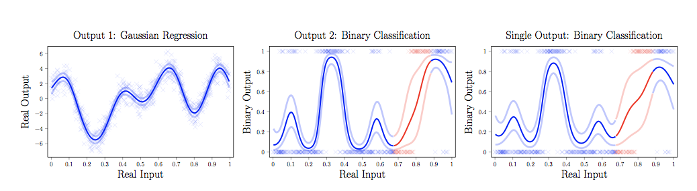
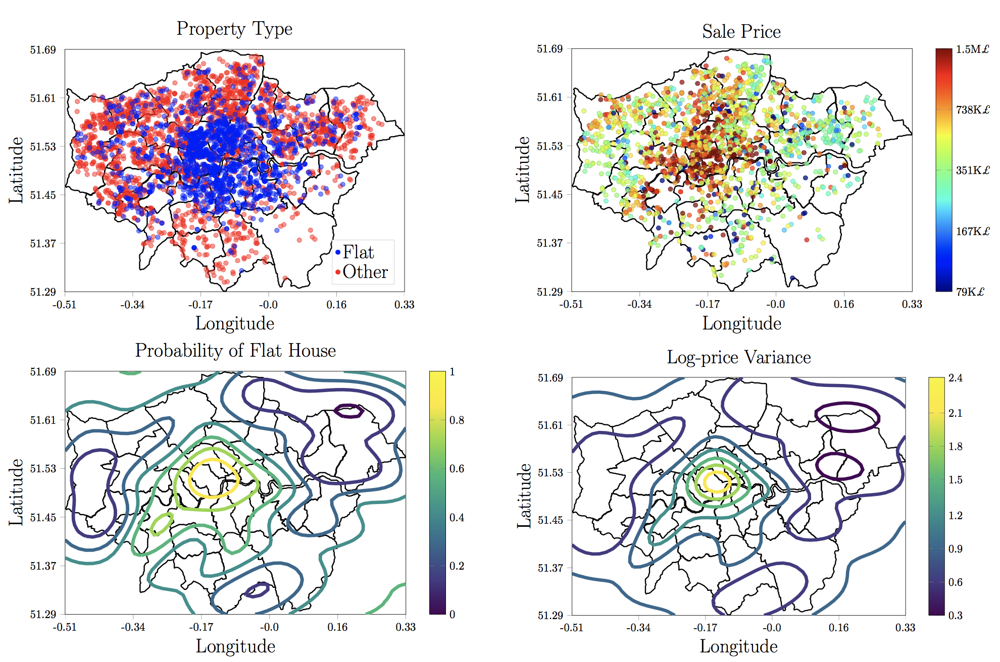

# Heterogeneous Multi-output Gaussian Processes

This repository contains the implementation of our Heterogeneous Multi-output Gaussian Process model (HetMOGP). The entire code is written in Python and connected with the GPy package, specially useful for Gaussian Process models. Our code consists of two main blocks:

- **hetmogp**: This module contains all model definitions, inference, and important utilities.
- **likelihoods**: General library of probability distributions for the heterogeneous model.

Our model is a novel extension of multi-output Gaussian processes for handling heterogeneous outputs (different statistical data-types). The following distributions are already available to be used: [Gaussian, Bernoulli, Heteroscedastic Gaussian, Categorical, Exponential, Gamma, Beta]. We expect to upload Student-t, Poisson, Ordinal and Dirichlet distributions code as soon as possible. If you want to contribute and include a new likelihood function, please follow the instructions given below add your new script to the *likelihoods* module.

Please, if you use this code, cite the following paper:
```
@article{MorenoArtesAlvarez18,
  title={Heterogeneous Multi-output {G}aussian Process Prediction},
  author={Pablo Moreno-Mu\~noz, Antonio Art\'es-Rodríguez and Mauricio A. \'Alvarez},
  journal={arXiv preprint arXiv:1805.07633},
  year={2018}
}
```

## Usage

Our Python implementation follows a straightforward sintaxis where you only have to define a list of input and output values, build the heterogeneous likelihood with the desired distributions that you need and call directly to the model class. That is

* Output and input data definition:
```
Y = [Y_hg, Y_ber, Y_cat]
X = [X_hg, X_ber, X_cat]
```
* Heterogeneous Likelihood definition:
```
likelihood_list = [HetGaussian(), Bernoulli(), Categorical(K=3)]
```
* Model and definition:
```
model = SVMOGP(X=X, Y=Y, Z=Z, kern_list=kern_list, likelihood=likelihood, Y_metadata=Y_metadata)
```

In notebooks>demo

* Missing Gap Prediction


* London House Prices


## Contributors

[Pablo Moreno-Muñoz](http://www.tsc.uc3m.es/~pmoreno/), [Antonio Artés-Rodríguez](http://www.tsc.uc3m.es/~antonio/) and [Mauricio A. Álvarez](https://sites.google.com/site/maalvarezl/)

For further information or contact:
```
pmoreno@tsc.uc3m.es
```
